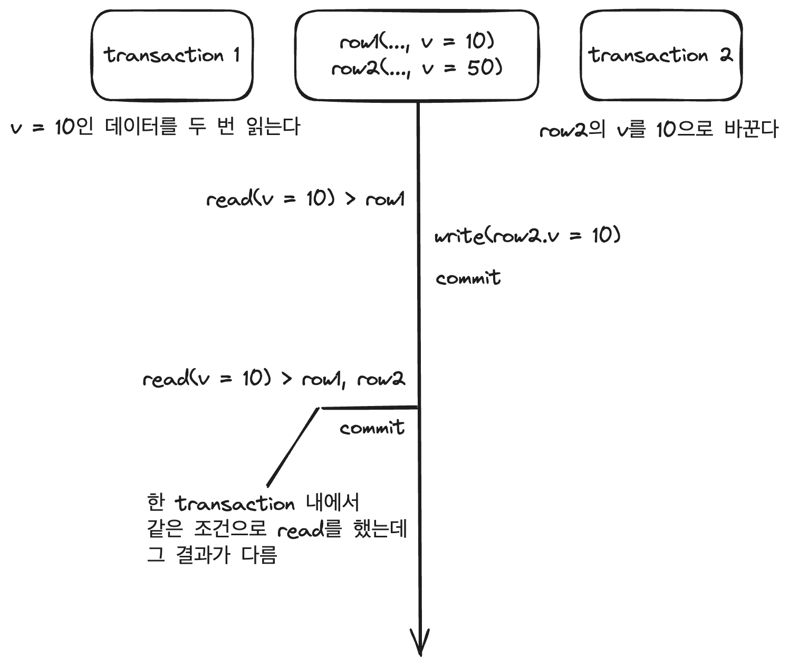
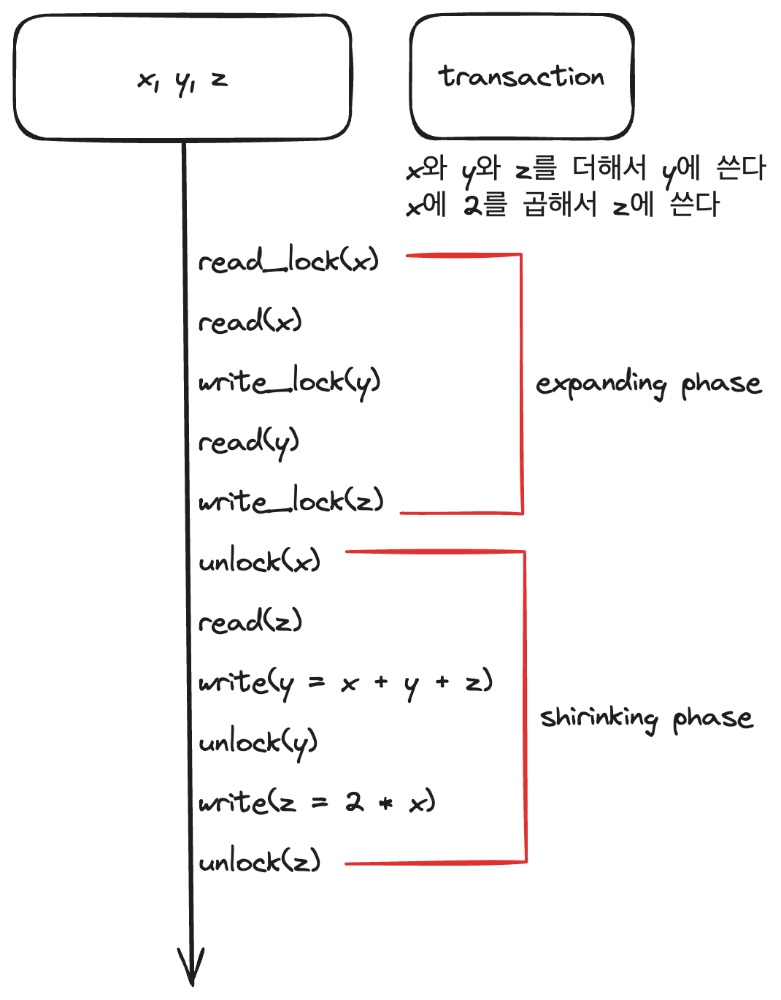

# Database(DB)  

- [1. Database](#1-database)  
    - [DBMS](#dbms)  
    - [Data models](#data-models)  
    - [Schema](#schema)  
    - [State](#state)  
- [2. Relational Data Model](#2-relational-data-model)  
    - [Relational database](#relational-database)  
    - [Relation의 특징](#relation의-특징)  
    - [Key](#key)
    - [데이터 무결성](#데이터-무결성)  
- [3. SQL](#3-sql)  
    - [Relational algebra](#relational-algebra)  
    - [Join](#join)  
- [4. 정규화](#4-정규화)  
- [5. Transaction](#5-transaction)  
    - [ACID](#acid)  
    - [동시성 제어](#5-1-동시성-제어)  
    - [Isolation level](#5-2-isolation-level)  
    - [Lock](#5-3-lock)  
    - [MVCC](#5-4-mvccmultiversion-concurrency-control)  
- [6. 회복](#6-회복)  
    - [트랜잭션과 회복](#트랜잭션과-회복)  
    - [로그 파일](#로그-파일)  
- [7. Index](#7-index)  
    - [Clustered index](#clustered-index)  
    - [Secondary index](#secondary-index)  
- [8. View](#8-view)  
- [9. DBMS 동작](#9-dbms-동작)  
    - [InnoDB](#innodb)  

 

## 1. Database  

전자적(electronically)으로 저장되고 사용되는, 관련있는(related) 데이터들의 조직화된 집합(organized collection)  

 

### DBMS  

DataBase Management Systems  
사용자에게 DB를 정의하고, 만들고 관리하는 기능을 제공하는 S/W 시스템  

metadata  
database를 정의하거나 기술하는 data  
e.g. 데이터 유형, 구조, 제약 조건, ...  
metadata 또한 DBMS를 통해 저장/관리됨  

 

### data models  

DB의 구조를 기술하는데 사용될 수 있는 개념들이 모인 집합  
DB 구조를 추상화해서 표현할 수 있는 수단을 제공  
data model은 여러 종류가 있으며, 추상화 수준과 DB 구조화 방식이 조금씩 다름  
DB에서 읽고 쓰기 위한 기본적인 동작들도 포함  

- conceptual(high-level)  
    - 일반 사용자들이 쉽게 이해할 수 있는 개념들로 이루어진 모델  
    - 추상화 수준이 가장 높음  
    - 비즈니스 요구 사항을 추상화하여 기술할 때 사용  
    - e.g. entity-relationship model(ER diagram)  
- logical(representational)  
    - 데이터가 컴퓨터에 저장될 때의 구조와 크게 다르지 않게 DB 구조화를 가능하게 함  
    - 특정 DBMS나 storage에 종속되지 않는 수준에서 DB를 구조화할 수 있는 모델  
    - e.g. relational data model, object data model, object-relational data model    
- physical(low-level)  
    - 컴퓨터에 데이터가 어떻게 파일 형태로 저장되는지를 기술할 수 있는 수단 제공  
    - data format, data orderings, access path, ...  
    - e.g. index  

 

### Schema  

data model을 바탕으로 database의 구조를 기술한 것  

**Three-schema architecture**  
DB system을 구축하는 architecture 중 하나  
user application으로 부터 물리적인 DB를 분리시키기 위함  
세 가지 level이 존재하며, 각각의 level마다 schema가 정의되어 있음  

- external schemas(user views) at external(view) level  
    - 특정 유저들이 필요로 하는 데이터만 표현  
    - 그 외 알려줄 필요가 없는 데이터는 숨김  
    - logical data model을 통해 표현  
- conceptual schemas at conceptual level  
    - 전체 DB에 대한 구조를 기술  
    - 물리적인 저장 구조에 대한 내용은 숨김  
    - entities, data types, relationships, user operations, constraints에 집중  
    - logical data model을 통해 기술  
- internal schemas at internal level  
    - 물리적으로 데이터가 어떻게 저장되는지 physicla data model을 통해 표현  
    - data storage, data structure, access path 등 실체가 있는 내용 기술  

 

### State  

DB에 있는 실제 데이터는 꽤 자주 바뀔 수 있음  
특정 시점에 DB에 있는 데이터를 database state 혹은 snapshot이라 함  
혹은 DB에 있는 현재 instances의 집합이라고도 함  

 

## 2. Relational Data Model  

**relation in mathmatics**  
subset of Cartesian product  
set of tuples 

 

domain
- set of atomic value  

domain name  
- domain 이름  

attribute  
- domain이 relation에서 맡은 역할 이름  

tuple  
- 각 attribute의 값으로 이루어진 리스트, 일부 값은 NULL일 수 있음  

relation  
- set of tuples  

relations name  
- relation의 이름  

 

**relation schema**  

relation의 구조를 나타냄  
relation 이름과 attributes 리스트로 표기  

e.g. STUDENT(id, name, grade, major, phone_number)  

attributes와 관련된 constraints도 포함  

 

**degree of relation**  

relation schema에서 attributes의 수  

위의 예시 STUDENT relation의 degree는 5  

 

### relational database  

relational data model에 기반하여 구조화된 database  

relational database는 여러 개의 relations로 구성됨  

### relation의 특징  

1. relation은 중복된 tuple을 가질 수 없음  
(tuple들의 set이기 때문)  

2. relation의 tuple을 식별하기 위해 attribute의 부분 집합을 key로 설정  

3. relation에서 tuple의 순서는 중요하지 않음  

4. 하나의 relation에서 attribute의 이름은 중복되면 안됨  

5. attribute는 atomic해야 함  
(composite or multivalued attribute 허용 안됨)  

 

### Key  

**super key**  

relation에서 tuples를 unique하게 식별할 수 있는 attributes set  

e.g. STUDENT(id, name, grade, major, phone_number)  
{id, name, grade, major, phone_number}  
{id, name}  
{id, name, phone_number}  

 

**candidate key(후보키)**  

어느 한 attribute라도 제거하면 unique하게 tuples를 식별할 수 없는 super key  

key or minimal superkey  

e.g. STUDENT(id, name, grade, major, phone_number)   
{id}  
{name, grade}  
-> 이름만으로 혹은 학년만으로는 누가 누구인지 식별할 수가 없음  

 

**primary key**  

relation에서 tuples를 unique하게 식별하기 위해 **선택된** candidate key  

 

**unique key**  

primary key가 아닌 candidate key  

alternate key  

 

**foreign key**  

다른 relation의 PK를 참조하는 attributes set  

 

### 데이터 무결성   
database에 저장된 데이터의 일관성과 정확성을 지키는 것  
일관성과 정확성을 잃은 database는 정보로서의 가치에 심각하게 문제가 있는 것  

**무결성 제약조건**  
- 도메인 무결성 제약조건  
    - relation 내의 tuples이 각 attribute의 domain에 저장된 값만을 가져야 함  
- 개체 무결성 제약조건  
    - 기본키 제약이라고도 함  
    - relation은 기본키를 지정하고, 기본키는 NULL 값을 가져서는 안되며, relation 내에 오직 하나의 값만 존재해야 함  
- 참조 무결성 제약조건  
    - relation 간의 참조 관계를 선언하는 제약조건  
    - 자식 relation의 foreign key는 부모 reloation의 기본키와 도메인이 동일해야 하며, 자식 reloation의 값이 변경될 때 부모 reloation의 제약을 받는다는 조건  

 

## 3. SQL  

Structured Query Language  
relational DBMS의 표준 언어  
하지만 실제 구현에 강제가 없기 떄문에 RDBMS마다 제공하는 SQL의 스펙이 조금씩 다름  

| relational data model | SQL |  
|---|---|
| relation | table |  
| attribute | column |  
|tuple | row |  
| domain | domain |  

 

Relation in SQL = table  
- multiset(bag) of tuples  
- 중복된 tuple을 허용  

 

### Relational Algebra  
이산수학의 set 이론에 기반한 relation에 관한 연산을 relational algebra라 함  

relation을 operand로 사용하고 그 결과도 relation으로 return되는 표현 방식  

초기의 relational algebra  
restriction, projection, product, union, intersection, difference, join, divide  

**relational closure**  
nested expression을 작성하는 것이 가능하도록 만드는 성질  
relational operation의 입력도 결과도 모두 relation이라는 것  

이렇게 되기 위해서는 연산자로 사용되는 두 relation의 attribute가 같아야 함  

UNION
- A UNION B
- $A \cup B$  

DIVIDE  
- A DIVIDE B
- $A \div B$  
- SQL에서는 exists로 표현  

INTERSECTION  
- A INTERSECT B  
- $A \cap B$  
- A join B (in MySQL)  

difference  
- A MINUS B  
- A - B  
- A left join B (in MySQL)  

product  
- A TIMES B  
- $A \times B = {(a, b) \mid a \in A and b \in B}$  
- 가능한 모든 pair의 조합  
- A cross join B (in MySQL)  

 

### JOIN  

두 개의 relation A[X, Y], B[Y, Z]에 공통 attribute로서 Y가 있을 때  
표기  
A JOIN B 또는 $A \bowtie B$

결과  
[X, Y, Z]  

e.g.  
A  
<x1, y1>  

B  
<y1, z1>  
<y1, z2>  

A JOIN B  
<x1, y1, z1>, <x1, y1, z2>  

 

**Cartesian product(cross join)**  
A와 B를 JOIN할 때, JOIN 조건을 생략하고 A relation의 모든 레코드를 B relation의 모든 레코드와 JOIN되는 경우  
모든 가능한 행들의 조합이 결과로 나오게 됨  

공통 attribute가 없는 두 relation에 대해 JOIN을 하는 경우도 cross join 결과와 같게 나옴  
(공통 attribute가 없어 조건을 명시하는 where절이 항상 true이기 때문)  
공통 attribute가 있는 relation에 대한 cross join은 inner join이라 함  

 

**SQL JOINs**  
  

 

## 4. 정규화  

**이상현상**  
database 테이블이 잘못 설계되면 삽입, 삭제, 수정 같은 데이터 조작을 했을 때 이상현상이 일어남  

한 개의 relation에 두 개 이상의 정보가 포함되어 있을 때 주로 나타나고, 3가지 상황이 존재  

1. 삭제 이상  
tuple 삭제 시 같이 저장된 다른 데이터까지 연쇄적으로 삭제되는 현상  
2. 삽입 이상  
tuple 삽입 시 특정 속성에 해당하는 값이 없어 NULL 값을 입력해야 하는 현상  
3. 수정 이상  
tuple 수정 시 중복된 데이터의 일부만 수정되어 데이터의 불일치 문제가 일어나는 현상  

 

**정규화(normalization)**  

이상현상이 발생하는 relation을 분해하여 없애는 과정  

1. 1NF  
모든 attribute 값이 원자(atomic) 값을 가지면 1NF(제 1정규형)을 만족한다고 함  

2. 2NF  
1NF를 만족하는 relation의 기본키가 복합키일때, 복합키의 일부분이 다른 attribute의 결정자인지 확인하고, 이를 만족한다면 2NF를 만족한다고 함  

3. 3NF  
attribute들이 이행적으로 종속되어 있는지 여부를 판단  
이행적 종속이란 2NF를 만족하고, A -> B, B -> C가 성립할 때 A -> C가 성립되는 종속성을 의미  

4. BCNF  
relation에 존재하는 함수 종속성에서 모든 결정자가 후보키이면 BCNF  

5. 4NF  
6. 5NF  

 

## 5. Transaction  

DBMS에서 데이터를 다루는 논리적인 작업의 단위  

논리적인 이유로 여러 SQL문을 단일 작업으로 묶어서 나누어질 수 없게 만든 것  
- 여러 R/W를 논리적으로 하나로 묶은 것  

 

**AUTOCOMMIT**  

각각의 SQL문을 자동으로 transaction 처리해줌  
SQL문이 성공적으로 실행되면 자동으로 commit  
실행 중에 문제가 있었다면 알아서 rollback  

 

### ACID  

**Atomicity**  
All or Nothing  
모두 성공하거나, 모두 실패하거나  
transaction은 논리적으로 쪼개어질 수 없는 작업 단위이기 때문에 내부의 SQL문들이 모두 성공하거나, 모두 실패해야 함  

 

**Consistency(일관성)**  
trasaction은 DB 상태를 consistent 상태에서 또 다른 consistent 상태로 바꿔줘야 함  
constraints, trigger 등을 통해 DB에 정의한 rule들을 transaction이 위반했다면, rollback해야 함  

 

**Isolation**  
여러 transaction들이 동시에 실행될 때도 이들이 혼자 실행되는 것처럼 동작하게 만듦  
DBMS는 여러 종류의 isolation level을 제공  

 

**Durability(지속성)**  
commit된 transaction은 DB에 영구적으로 저장됨  
DB system에 문제가 생겨도 commit된 transaction은 DB에 남아있음  

 

### 5-1. 동시성 제어  

transaction이 동시에 수행되는 상황에서 DB의 일관성을 해치지 않도록 transction의 데이터 접근을 제어하는 DBMS의 기능  

**Schedule**  

여러 transaction들이 동시에 실행될 때 각 transaction에 속한 operation(Read, Write, Commit, ...)들의 실행 순서  

Serial schedule  
- transaction들이 겹치지 않고 한 번에 하나씩 실행되는 schedule  
- 한 번에 하나의 transaction만 실행되기 때문에 좋은 성능을 낼 수 없고(I/O가 발생하는 동안 CPU가 여유롭더라도 다른 transaction을 실행하지 않기 때문) 현실적으로 사용하기 어려운 방식  

Nonserial schedule  
- transaction들이 겹쳐서(interleaving) 실행되는 schedule  
- transaction들이 겹쳐서 실행되기 때문에 동시성이 높아져 같은 시간 동안 더 많은 transaction을 처리할 수 있음  
- transaction들이 어떤 형태로 겹쳐서 실행되는지에 따라 이상한 결과가 나올 수 있음  

 

**Conflict of two operations**  

1. 두 operation은 서로 다른 trasaction 소속  
2. 두 operation이 같은 데이터에 접근  
3. 최소 하나의 operation은 write operation  

conflict operation은 순서가 바뀌면 결과도 바뀜  

 

**Conflict equivalent for two schedules**  

1. 두 schedule은 같은 transaction들을 가짐  
2. 모든 conflict operation들의 순서가 양쪽 schedule에서 모두 동일  

nonserial schedule이 어떤 serial schedule과 conflict equivalent할 때, 이를 **conflict serializable**이라 함  

nonserial schedule이라도 conflict serializable하다면 정상적인 결과를 냄  

 

**cascadeless schedule**  

schedule 내에서 어떤 transaction도 commit 되지 않은 transaction이 write한 데이터를 읽지 않는 경우  

 

**strict schedule**  

schedule 내에서 어떤 transaction도 commit 되지 않은 transaction이 write한 데이터를 읽지도 쓰지도 않는 경우  

 

### 5-2. isolation level  

transaciton에서 일관성 없는 데이터를 허용하도록 하는 수준  

아래 나오는 모든 이상 현상이 발생하지 않도록 할 수 있지만, 그렇게 된다면 동시에 처리 가능한 transaction 수가 줄어들어 DB의 전체 처리량(throughput)이 하락하게 될 것  

**이상 현상**  

Dirty Read  
- commit되지 않은 변화를 읽은 경우  
-   

 

Non-repeatable Read  
- 같은 데이터의 값이 달라지는 경우  
-   

 

Phantom Read  
- 없던 데이터가 생김  
-   

 

Dirty Write  
- commit 안된 데이터를 write함  
-   

 

Lost update  
- 업데이트를 덮어 씀  
-   

 

**Isolation level**  

| Isolation level | Dirty Read | Non-repeatable Read | Phontom Read |  
| --- | --- | --- | --- |  
| Read uncommitted | O | O | O |  
| Read committed | X | O | O |  
| Repeatable read | X | X | O |  
| Serializable | X | X | X |  

 

**Snapshot isolation**  

type of MVCC(MultiVersion Concurrency Control)  
transaction 시작 전에 commit된 데이터만 보임  
같은 데이터에 대해 write - write 충돌이 일어나면 먼저 commit된 사항을 인정하고, 뒤의 것은 abort함  

 

### 5-3. Lock  

**Read lock(shared lock)**  

read 할 때 사용  
다른 transaction이 같은 데이터를 read하는 것을 허용  

 

**Write lock(exclusive lock)**  

read/write(insert, modify, delete) 할 때 사용  
다른 transaction이 같은 데이터를 read/write하는 것을 허용하지 않음  

 

**2PL(2 Phase Lock)**  

transaction에서 모든 locking operation이 최초의 unlock operation보다 먼저 실행되도록 하는 것  

serializablility 보장  

  

 

Expanding phase  
- lock을 취득하기만 하고 반환하지 않는 phase  

 

Shirinking phase  
- lock을 반환만 하는 phase  

 

### 5-4. MVCC(MultiVersion Concurrency Control)  

데이터를 읽을 때 특정 시점(isolation level 별로 상이) 기준으로 가장 최근에 commit된 데이터를 읽음  

commit 후에 unlock 함  

데이터 변화(write) 이력을 관리  

read와 write는 서로를 block하지 않음  

read lock을 사용하지 않고 구현됨  

MySQL에서는 read committed, repeatable read 레벨에서 MVCC가 적용됨  

 

## 6. 회복  

DB에 장애가 발생했을 때 DB를 일관성있는 상태로 되돌리는 DBMS의 기능  

 

### 트랜잭션과 회복  

transaction은 DB 회복의 단위  
transaction은 데이터의 변경 내용을 한순간에 모두 DB에 기록하지 않음  
일단 변경한 내용을 로그에 기록한 후, DB에 반영함  
DBMS의 회복 관리자는 transaction의 ACID 중 A, D를 보장해 장애로부터 DB를 보호  

 

### 로그 파일  

DBMS는 transaction이 수행 중이거나 수행이 종료된 후 발생하는 DB 손실을 방지하기 위해 transaction의 DB 기록을 추적하는 로그 파일을 사용  

데이터의 변경 기록을 저장해 둔 로그 파일을 이용하면, 시스템 장애도 복구할 수 있음  

1. 시스템 운영 중 장애가 발생하여 시스템이 다시 가동되었을 때, DBMS는 로그 파일을 먼저 살핌  
2. DBMS는 transaction이 종료되었는지, 혹은 중단되었는지 여부를 판단  
    2-1. 종료된 transaction은 종료를 확정하기 위해 재실행(REDO)  
    2-2. 중단된 transaction은 없던 일로 되돌리기 위해 취소(UNDO)함  

 

## 7. Index  

데이터를 빨리 찾기 위해 column의 값과 레코드가 저장된 주소를 key-value 쌍으로 기록해둔 자료구조  

MySQL의 경우 MYI(MySQL Index)파일에 저장됨(추가적인 물리 저장 공간 필요)  

대부분의 DBMS에서 인덱스는 B-Tree 구조로 되어 있음  

root node > internal node > ... > leaf node  
leaf node에 찾고자 하는 데이터의 저장 위치에 대응하는 rowID(logical position of Table's row)를 갖고 있음  

데이터의 변경이나 추가가 잦을 경우 B-Tree의 모양을 유지하기 위해 노드의 분할, 이동이 자주 발생하는 문제가 생길 수 있음  

### Clustered index  

생성 시 데이터 페이지 전체가 다시 정렬됨  

테이블 당 하나만 생성 가능, 어느 column에 생성하는지에 따라 성능이 달라짐  

secondary index(보조 인덱스)보다 검색 속도는 빠르지만 INSERT, UPDATE, DELETE는 느림  

MySQL의 경우 PK가 있다면 PK를 클러스터형 인덱스로, 없다면 unique이면서 NOT NULL인 column을, 그것도 없으면 임의로 보이지 않는 column을 만들어서 저장  

### Secondary index  

개념적으로 후보키에만 부여 가능한 인덱스  

생성 시 데이터 페이지는 그냥 둔 상태에서 별도의 페이지에 인덱스를 구성  

테이블 당 여러 개 생성 가능  

 

## 8. View  

Read only  

사용자에게 접근이 허용된 자료만을 제한적으로 보여주기 위해 하나 이상의 기본 테이블로부터 유도된, 이름을 가지는 가상 테이블  

저장장치 내에 물리적으로 존재하지 않지만 사용자에게는 있는 것처럼 보임  

쿼리에 대한 껍데기  

일종의 권한 관리 때문에 많이 쓰기도 함  

 

## 9. DBMS 동작  

DBMS도 운영체제에서 실행되는 응용 프로그램의 일종  

실제 데이터가 저장되는 곳은 HDD, SSD  
이 때문에 데이터의 R/W에 disk I/O(느림)가 발생  
그렇기 때문에 메인 메모리에 buffer pool을 만들어 사용  

### InnoDB  

ACID, row-level locking, MVCC, foreign keykey 지원  

tablespace 개념 지원  
- 데이터를 저장하는 가장 최소의 논리적 단위 : database block  
- block이 모여 extent  
- extent가 모여 segment  
- segment가 모여 table space가 됨  
- table space는 file에 해당됨  

 

  

 

**InnoDB In-Memory Structures**  

1. Buffer Pool  
    - InnoDB가 table과 index에 접근할 때 메인 메모리에 캐시하는 공간  
    - 전용 서버의 경우 물리 메모리의 80%까지 buffer pool로 할당될 수 있음  
    - 캐시 관리의 용이함을 목적으로 page(다수 행을 관리할 수 있는)들의 linked list형태로 구현됨  
    - LRU와 유사하게 관리  
        - buffer pool에 새로운 page를 위한 공간이 필요해질 경우, 가장 이전에 사용된 page를 치우고, 새 page를 리스트의 가운데 추가  
        - 이 가운데 지점을 통해 list를 두개의 sublist처럼 다룸  
        - head쪽, 최근에 접근한 새로운(young) page들의 sublist  
        - tail쪽, 비교적 이전에 접근된 old page들의 sublist  
    -   
2. Change Buffer  
    - INSERT, UPDATE, DELETE 같은 DML의 결과로 secondary index에 영향을 주는 page들이 buffer pool에 없다면 disk I/O를 발생시키지 않고, change buffer에 변경 사항을 저장  
    - 시스템이 한가할 때, change buffer가 가득 찼을 때, 해당 page가 SELECT에 의해 buffer pool로 캐싱될 때 혹은 주기적으로 disk I/O를 발생시킴  
    -   
3. Adaptive Hash Index  
    - 자주 사용되는 column을 해시로 정의하여, B-Tree를 타지 않고 바로 데이터에 접근할 수 있음  
4. Log Buffer  
    - 디스크에 쓰여질 로그 파일들의 데이터를 보관하는 메모리 공간  
    - default size = 16MB  
    - log buffer에 있는 데이터들은 주기적으로 디스크에 flush됨  

 

**InnoDB On-Disk Structures**  

1. Tables  
2. Inexes  
    - Clustered Indexes  
        - PK(기본키) index  
        - PK 값이 비슷한 레코드끼리 묶어서 저장됨  
    - Secondary Indexes  
        - 보조 인덱스  
        - secondary index의 각 레코드는 PK column과 지정한 column의 조합으로 저장됨  
    - spatial index(R-Tree?)를 제외한 InnoDB의 인덱스들은 B-tree 구조  
3. Tablespaces  
4. Doublewrite Buffer  
    - InnoDB의 데이터 파일에 page를 쓰기 전, buffer pool에서 flush된 page를 저장하는 공간  
5. Redo Log  
6. Undo Logs  