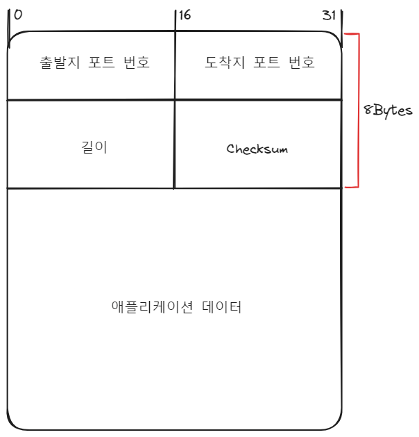
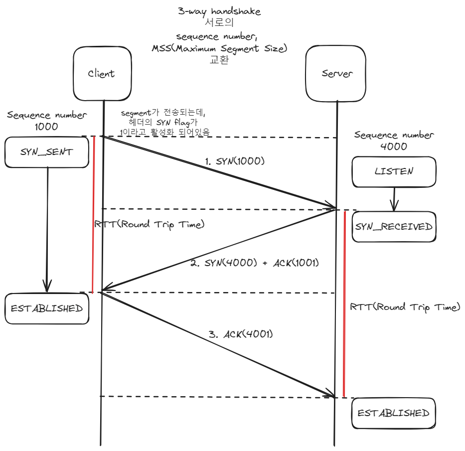
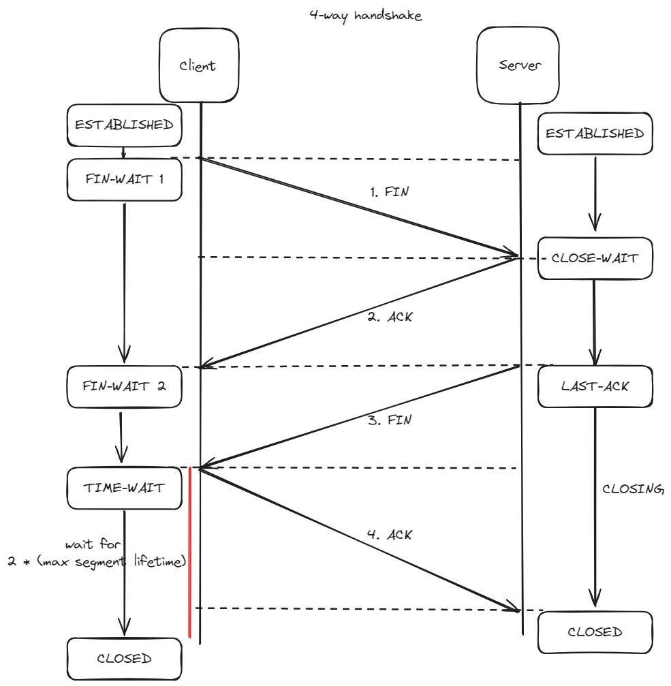

# Network  

- [1. OSI 7 Layer](#1-osi-7-layer)
- [2. TCP/IP Protocol](#2-tcpip-protocol)
- [3. Data Link(L2)](#3-data-linkl2)
- [4. Network(L3)](#4-networkl3)
- [5. Transport(L4)](#5-transportl4) 
    - [UDP](#udp)
    - [TCP](#tcp)
    - [HandShake](#handshake)
- [6. Application(L5)](#6-applicationl5)  
    - [DNS](#dns)

 

## 1. OSI 7 Layer  

**Layered Architecture**
- 각 레이어는 필요한 커뮤니케이션 기능의 subset들을 수행  
- 각 레이어는 자신 바로 아래 레이어에만 의존해 기능을 수행  
- 각 레이어는 자신 바로 위 레이어에만 서비스를 제공  
- 특정 한 레이어에 대한 변경이 다른 레이어에 대한 변경까지 요구해선 안된다  

  

 

**OSI 7 Layers**  
1계층부터 설명  
- Physical Layer(L1)
    - 장치 간 물리적 인터페이스  
    - bit 단위로 데이터 전송  
- Data Link Layer(L2)
    - 신뢰할 수 있는 링크 활성화, 유지 및 비활성화하는 수단  
    - 직접 연결된 노드 간의 통신  
    - MAC 주소 기반 통신(ARP)
    - 에러 감지 및 컨트롤  
- Network Layer(L3)
    - 호스트 간의 통신(IP)  
    - 정보 전달, 라우팅  
- Transport Layer(L4)
    - 종단 시스템 간의 데이터 교환  
    - 흐름 제어
    - TCP, UDP
- Session Layer(L5)
    - 애플리케이션 간 통신에서 세션 관리  
- Presentation Layer(L6)
    - 애플리케이션 간의 통신에 서 메시지 포맷 관리  
    - 인코딩 - 디코딩, 암호화 - 복호하, 압축 - 압축 해제  
- Application Layer(L7)
    - 애플리케이션 목적에 맞는 통신 방법 제공
    - HTTP, DNS, SMTP, FTP

 

## 2. TCP/IP Protocol  

**TCP/IP Protocol Architecture**  
- Physical Layer(L1)
    - bit 단위 데이터 전송  
    - 데이터의 물리적 이동  
    - bit
- Data Link Layer(L2)
    - 프레임화, 송수신 주소 명시  
    - error detection and correction  
    - NIC, Ethernet, Swtiches    
    - MAC
    - Frame
- Network Layer(L3)
    - 상위 계층에서 내려온 데이터에 IP헤더 붙여 전송  
    - 데이터를 패킷 단위로 쪼갬  
    - 도착지까지의 최적의 경로 찾아줌(라우팅)  
    - IP(Host 식별자), Routers  
    - Packet / Diagram  
- Transport(Host-to-Host) Layer(L4)
    - 종단 간 패킷 전송기능 제공  
    - TCP, UDP
    - Port 번호  
    - Segment
- Application Layer(L5)
    - 종단 시스템에 있는 애플리케이션 간 패킷 교환  
    - HTTP, FTP, SMTP

 

## 3. Data Link(L2)  

NIC(Network Interface Card)
- 흔히 LAN(Local Area Network) 카드
- MAC address를 가짐

Frame
- L2에서의 데이터 단위

**L2 스위치**  

MAC address(48bit) 기반으로 스위칭  

L2 Access 스위치
- 네트워크 이용주체(end point)를 위한 스위치  
- end point가 가장 처음 만나는 스위치

 L2 Distribution 스위치  
- 스위치를 위한 스위치  

 

## 4. Network(L3)  

**IP address**  
Host에 대한 식별자  

IPv4 : 32bit  
IPv6 : 128bit

8bit씩 끊어서 표시(e.g. 192.168.25.5)
8bit씩 끊었기 때문에 한 칸에 올 수 있는 수는 0 ~ 255  

Subnet mask  
IP address에서 Network ID의 길이를 나타내는 것

IP address와 서브넷 마스크를 and 연산하면 network ID가 나옴  

e.g. IP address - 192.168.25.5, Subnet mask - 255.255.255.0
192 & 255 > 1100 0000 & 1111 1111 > 1100 0000 > 192  
168 & 255 > 1010 1000 & 1111 1111 > 1010 1000 > 168  
25  & 255 > 0001 1001 & 1111 1111 > 0001 1001 > 25  
5   & 255 > 0000 1001 & 0000 0000 > 0000 0000 > 0  

Network ID = 192.168.25.0 (IP address 32bit 중 24bit)  
192.168.25.5/24 (24bit는 Network ID고 8bit는 Host ID)  

 

**L3 = Data plane + Control plane**  

  

Routing Processor  
- 라우팅 알고리즘을 수행할 프로세서  

Forwarding(Data plane, H/W)  
- 패킷을 라우터에서 다음 라우터로 이동시킴  
- 각 라우터에서 수행됨  
- 목적지에 대한 헤더를 추출해 정보를 control plane에 전달  

Routing(Control plane, S/W)  
- 출발지에서 목적지로 패킷을 어떻게 이동시킬지 결정하는 알고리즘  
- 패킷(데이터그램)을 라우터에서 라우터로 어떤 방법을 통해 전송할지 결정  

 

**패킷 스케줄링**  
패킷이 Output port의 출력 링크를 통해 전송되는 순서를 스케줄링  

1.FIFO  

2.Priority  
- 우선순위가 높은 패킷부터 전송  
- IP source/destination, port number 등으로 우선순위 결정  

3.RR(Round Robin)  
- 여러 class와 각 class마다 queue가 존재  
- Queue를 돌면서 각 queue에서 하나의 패킷씩 보냄  

4.WFQ(Weighted Fair Queuing)  
- class마다 queue를 두고 class 별로 보내는 것은 RR과 동일  
- 각 class에는 가중치가 있고, 가중치 수만큼 패킷을 처리  
(RR은 weight가 1로 전부 같은 WFQ로 볼 수 있음)  

 

**Routing Architecture**  

|   | Distance-Vector | Link-State|
|---|---|---|
|Algorithm| Distributed Bellman-Ford|Dijkstra|
|Routing info.|Distance-Vector|Link-State|
|Exchange with| Neighbor Routers|All Routers in the Network|
|Standard Routing Protocol| RIP   (Routing Information Protocol) | OSPF    (Open Shortest Path First)|
|   | 최소 비용 경로의 계산이 라우터들에 의해 반복적이고 분산된 방식으로 수행됨  |  네트워크 전체에 대한 완전한 정보를 가지고 출발지와 목적지 사이의 최소 비용 경로를 계산 |  
  
 

## 5. Transport(L4)    

서로 다른 호스트에서 동작하는 애플리케이션 프로세스에게 직접 통신 서비스를 제공하는 역할  

소켓 - 네트워크 -> 프로세스, 프로세스 -> 네트워크로 데이터를 전달하는 출입구  

Transport(L4) 계층은 데이터를 직접 프로세스로 전달하지 않고 소켓에게 전달  

 

### UDP  
비신뢰, 비연결형  
1대1 통신(unicast), 1대다 통신(broadcast), 다대다 통신(multicast)  

1. 다중화/역다중화  
2. 간단한 오류검사  

TCP의 3-way handshake 과정이 없기 때문에 TCP보다 빠름  

 

UDP 세그먼트의 구조(헤더 + 데이터)  

 

### TCP  
신뢰, 연결형  
데이터의 순서 유지를 위해 각 바이트마다 번호 부여  
handshake를 통해 연결  
1대1 통신(unicast)  
흐름 제어(수신자 버퍼 오버플로우 방지)  
혼잡 제어(네트워크 내 패킷 수가 과도하게 증가하는 현상 방지)  
전이중(Full-Duplex), 점대점(Point to Point) 서비스  

 

TCP 세그먼트(헤더 + 데이터)  
  

### handshake  
3-way handshake를 통해 연결, 4-way handshake를 통해 해제  

**3-way handshake**  
  

1.Client > Server  
- TCP 세그먼트 헤더의 SYN Flag 1로 설정  
- sequence number를 TCP 세그먼트 헤더의 sequence number에 설정  

2.Server > Client  
- 클라이언트가 보낸 데이터그램의 SYN Flag를 확인  
- 연결에 사용될 버퍼와 변수들을 할당  
- SYN Flag를 1로 설정  
- ACK number 필드를 받은 TCP 세그먼트 헤더의 sequence number + 1로 설정  
- sequence number를 TCP 세그먼트 헤더의 sequence number에 설정  

3.Client > Server  
- SYN Flag와 ACK를 확인 후 연결에 사용될 버퍼와 변수 할당  
- 서버에게서 받은 sequence number + 1로 ACK number필드 설정  
- 서버로 전송  

 

**4-way handshake**  
  

1.Client > Server  
- TCP 세그먼트 헤더의 FIN Flag를 1로 설정 후 전송  

2.Server > Client  
- Client가 보낸 세그먼트를 수신했다는 의미로 ACK를 담아 전송  

3.Server > Client  
- TCP 세그먼트 헤더의 FIN Flag를 1로 설정 후 전송  

4.Client > Server  
- Server가 보낸 세그먼트를 수신했다는 의미로 ACK를 담아 전송  
- 연결하며 할당했던 자원(버퍼, 변수) 해제  

 

**File download(Client PC - Server) example**  
  
(출처 - https://youtu.be/K9L9YZhEjC0)  

 

## 6. Application(L5)  
SMTP, HTTP, FTP, SSL, ...  

### DNS  
계층적으로 이루어진 분산형 데이터베이스  
Domain name을 IP address로 변환하는 역할  

  
(출처 - KISA, https://www.kisa.or.kr/1041103)  

 

**www.naver.com 입력시**  
1. PC의 DNS cache 검색  
2. DNS에 질의  
    1. ISP가 보유한 DNS가 응답  
    2. 상위 DNS에 질의 후 응답  

  

 

**DNS 유형**  
1. Root DNS  
    - 전 세계에 13개  
2. TLD(Top-Level-Domain) servers  
    - com, org, net 등의 최상위 레벨 혹은 국가 도메인(uk, fr, ca, kr, ...)  
    - .com  
    - .edu  
3. Local DNS  
    - 계층에 속하지 않음  
    - ISP가 local DNS 서버를 가짐  
    - Host가 DNS query를 만들면 Local DNS에 보내짐  