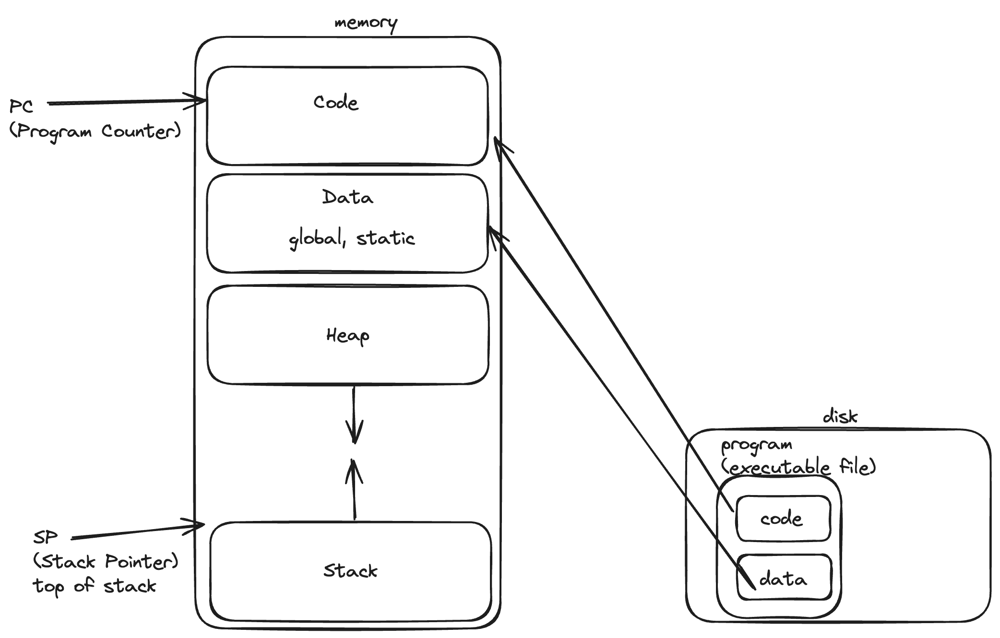
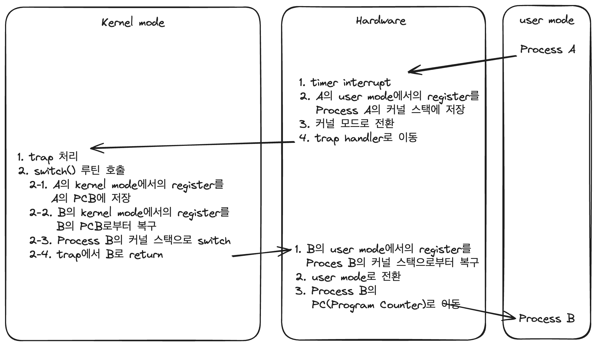

# Operating Systems

## 1. OS
하드웨어와 응용 프로그램 사이의 인터페이스, 중재자 역할.
CPU, 메모리, I/O 장치, 저장장치 등의 하드웨어 자원들을 관리하고 프로그램들이 상호작용할 수 있도록 한다.

시스템이 정확하고, 효율적으로 작동하도록 한다.

**Virtualization(가상화)**

OS는 물리적인 자원(CPU, 메모리, 저장장치)를 가상의 형태로 만든다.

e.g. CPU의 가상화
- CPU의 가상화로 우리는 많은 프로그램이 동시에 실행되는 것처럼 인식한다.

**System call**

kernel이 **주요 기능**들을 user program이 사용할 수 있도록 안전하게 노출시키는 수단 혹은 인터페이스(APIs, standart library)

**주요 기능**으로는
- 파일 시스템에 대한 접근
- 프로세스 생성
- 프로세스간 통신
- 메모리 추가 할당

 

## 2. Process
An instance of a program in execution(실행중인 프로그램)

각 프로세스는 PID(process ID)라는 고유 값을 가지고 이를 이용해 식별된다.

프로세스에 포함되어 있는 요소들
- CPU context(registers)
    - PC(Program Counter)
    - Stack pointer
- OS resources
    - address space
    - open files
    - ...
- Other informations
    - PID
    - state
    - owner
    - ...

프로그램이 프로세스가 되는 과정

1. 디스크에 있는 프로그램 코드를 메모리(프로세스의 addresss space)로 로드
2. 프로그램의 런타임 스택 할당
    - local variables, function parameters, return address를 위해 스택 사용
    - main() function의 argc, argv 매개변수를 통해 스택을 초기화한다.
3. 프로그램의 힙 생성
    - 명시적으로 요청된 동적 할당 데이터에 사용
    - 프로그램은 malloc(), free()을 호출함으로서 이러한 공간을 요청
4. OS의 기타 초기화 작업
    - I/O 설정
        - 각 프로세스는 기본적으로 STDIN, STDOUT, STDERR라는 세 개의 file descriptor를 가짐
5. 흔히 main()이라 불리는 진입점부터 프로그램이 실행

 
프로세스의 상태

프로세스는 세 개의 상태를 갖는다.
- Running
    - 프로세스가 CPU를 할당받아 실행중인 상태
- Ready
    - 실행된 준비가 되었지만, OS로부터 CPU를 할당받지 못한 상태
- Blocked
    - I/O 혹은 어떤 이벤트 때문에 실행 중단 상태
    - 프로세스가 디스크에 I/O 작업을 요청하면, blocked 상태가 되고 그 덕에 다른 프로세스가 CPU를 사용

 

### PCB(Process Control Block)
프로세스에 대한 정보를 포함
- CPU registers
- PID, PPID(Parent PID), process group, priority, process state, signals
- CPU scheduling information
- Memory management information
- Accounting information
- File management information
- I/O status information
- Credentials

 

### Context Switch
한 프로세스에서 다른 프로세스로 CPU 제어권을 넘기는 것

여기에는 비용(overhead)이 든다
- registers, memory maps를 저장하고 복구하는 비용
- 메모리 캐시를 비우고 다시 로드하는 비용
- 다양한 테이블과 리스트를 업데이트하는 비용

컨텍스트 스위칭은 순수 비용이다. 이 과정 동안 CPU는 컨텍스트 스위칭을 위한 일만 하기 때문에 그 어떤 다른 일도 하지 않는다.

1. 현재 프로세스의 상태를 PCB에 저장
2. 대기열의 다음 프로세스를 선택하고 해당 프로세스의 PCB를 복원
3. 해당 PCB의 PC(Program Counter)를 통해 해당 지점부터 작업을 수행

timer interrupt에 의한 context switch 과정
- 배경
    - OS가 부팅될 때 interrupt timer 실행
    - 일정 시간마다 timer interrupt 발생

 

## 3. Scheduling
기본적으로 각 CPU 코어는 한 번에 하나의 프로세스를 실행할 수 있다. 단일 CPU 코어가 있는 시스템의 경우 한 번에 2개 이상의 프로세스가 실행될 수 없지만, 다중 코어 시스템은 한 번에 여러 프로세스를 실행할 수 있다.

비선점형(Non-preemptive) 스케줄링
- 실행중인 프로세스가 CPU를 포기할 때까지 스케줄러가 기다림

선점형(Preemptive) 스케줄링
- 대부분의 모던 스케줄러들이 선점형
- 스케줄러가 프로세스에 interrupt를 걸고 context switch를 강제할 수 있음

### 1. FIFO(First In, First Out)
- 비선점형
- 들어온 순서대로 수행
- 실생활에서 줄 서는 것과 같은 방식
- Convoy Effect
    - 먼저 도착한 작업의 수행 시간이 아주 길다면, 간발의 차로 도착한 작업의 수행 시간이 짧더라도 앞의 작업이 끝날 때까지 기다려야 함

 

### 2. SJF(Shortest Job First)
- 비선점형
- 수행 시간이 짧은 것부터 처리
- Convoy Effect
    - 가장 먼저 도착한 작업의 수행 시간이 아주 길고, 간발의 차로 도착한 작업의 수행 시간이 아주 짧더라도 이미 수행중인 앞의 작업이 끝날 때까지 기다려야 함

 

### 3. STCF(Shortest Time to Completion First)
- SJF에 선점형 방식 추가
- 작업의 순서를 완료까지 남은 시간이 가장 짧은 순으로 스케줄링
- e.g.
    - 100초짜리 작업 A가 10초 동안 수행됐음
    - 10초짜리 작업 B, C가 차례로 도착
    - 수행중이던 A를 멈추고 B, C를 수행한 후 나머지 A 작업 수행

 

### 4. RR(Round Robin)
- 선점형
- No startvation(기아 현상)
- Time slicing 스케줄링
- 각 작업을 일정 시간(time slice) 동안 수행하고 run queue에 있는 다음 작업 수행
    - run queue는 circular FIFO queue처럼 동작
- time slice가 timer-interrupt의 배수여야 함(그렇지 않으면 CPU를 가져올 수 없음)
    - time slice가 짧아지만 모든 작업을 균등하게 한번씩 수행하겠지만 context switch가 잦아짐
    - time slice가 길어지면 각 작업이 한 번씩 수행되는 response time에서 손해를 봄

위 방식들은 real world에서는 좋은 퍼포먼스를 내기 힘듦

 

### MLFQ(Multi-Level Feedback Queue)
각각의 우선 순위를 가지는 queue들을 보유

1. 최상위 순위의 queue부터 실행 후, 해당 queue의 할당량이 끝나면 하위 queue의 작업들을 수행

2. 우선 순위가 높은 queue의 작업이 우선이며, 우선 순위가 같은 queue의 작업들에 대해서는 RR(Round Robin) 적용

3. 모든 프로세스는 처음 시스템에 진입 시, 가장 우선 순위가 높은 queue에서 작업을 시작

4. 작업이 해당 우선 순위에 할당된 time slice를 다 쓰고도 작업이 끝나지 않았다면, CPU-intensive Job(인코딩, 컴파일 같이 긴 시간이 필요하고 response time은 별로 중요하지 않은 작업)으로 판단하고 우선 순위를 감소 시켜 후순위 queue에 배치
    - time slice가 10ms일 때, 어떤 작업이 매 CPU할당 때마다 9ms씩 CPU를 사용하고 반납하더라도, 작업을 반복하여 총 10ms를 다 사용하게 된다면 강등시킨다

5. 작업이 time slice 이전에 CPU를 반환한다면 interactive job으로 판단하고 우선 순위를 유지

6. 일정 주기마다 모든 작업을 가장 우선 순위가 높은 queue로 이동시켜 startvation을 방지하는 aging 기법 적용