# Operating Systems

- [1. OS](#1-os)
- [2. Process](#2-process)
    - [PCB](#pcbprocess-control-block)
    - [Context Switch](#context-switch)
- [3. Scheduling](#3-scheduling)
    - [MLFQ](#mlfqmulti-level-feedback-queue)
- [4. Virtual Memory](#4-virtual-memory)
    - [Segmentation](#4-1-segmentation)
    - [Paging](#4-2-paging)
    - [TLB](#4-3-tlbstranslation-look-aside-buffers)
    - [Swapping](#4-4-swapping) 
- [5. Threads](#5threads) 
    - [Process vs Thread](#5-1-process-vs-threads)
    - [Multi-Threading의 이점](#5-2-multi-threading의-이점)
    - [Kernel-level Thread](#5-3-kernel-level-threads)
    - [User-level Thread](#5-4-user-level-threads)
    - [Race Condition](#5-5-race-condition)
    - [Lock](#5-6-locks)
    - [Semaphore](#5-7-semaphore)
- [6. File system](#6-file-system)

<br/>


## 1. OS
하드웨어와 응용 프로그램 사이의 인터페이스, 중재자 역할.
CPU, 메모리, I/O 장치, 저장장치 등의 하드웨어 자원들을 관리하고 프로그램들이 상호작용할 수 있도록 한다.

시스템이 정확하고, 효율적으로 작동하도록 한다.

**Virtualization(가상화)**

OS는 물리적인 자원(CPU, 메모리, 저장장치)를 가상의 형태로 만든다.

e.g. CPU의 가상화
- CPU의 가상화로 우리는 많은 프로그램이 동시에 실행되는 것처럼 인식한다.

**System call**

kernel이 **주요 기능**들을 user program이 사용할 수 있도록 안전하게 노출시키는 수단 혹은 인터페이스(APIs, standart library)

**주요 기능**으로는
- 파일 시스템에 대한 접근
- 프로세스 생성
- 프로세스간 통신
- 메모리 추가 할당

<br/>

## 2. Process
An instance of a program in execution(실행중인 프로그램)

각 프로세스는 PID(process ID)라는 고유 값을 가지고 이를 이용해 식별된다.

프로세스에 포함되어 있는 요소들
- CPU context(registers)
    - PC(Program Counter)
    - Stack pointer
- OS resources
    - address space
    - open files
    - ...
- Other informations
    - PID
    - state
    - owner
    - ...

프로그램이 프로세스가 되는 과정

1. 디스크에 있는 프로그램 코드를 메모리(프로세스의 addresss space)로 로드
2. 프로그램의 런타임 스택 할당
    - local variables, function parameters, return address를 위해 스택 사용
    - main() function의 argc, argv 매개변수를 통해 스택을 초기화한다.
3. 프로그램의 힙 생성
    - 명시적으로 요청된 동적 할당 데이터에 사용
    - 프로그램은 malloc(), free()을 호출함으로서 이러한 공간을 요청
4. OS의 기타 초기화 작업
    - I/O 설정
        - 각 프로세스는 기본적으로 STDIN, STDOUT, STDERR라는 세 개의 file descriptor를 가짐
5. 흔히 main()이라 불리는 진입점부터 프로그램이 실행

<br/>
프로세스의 상태

프로세스는 세 개의 상태를 갖는다.
- Running
    - 프로세스가 CPU를 할당받아 실행중인 상태
- Ready
    - 실행된 준비가 되었지만, OS로부터 CPU를 할당받지 못한 상태
- Blocked
    - I/O 혹은 어떤 이벤트 때문에 실행 중단 상태
    - 프로세스가 디스크에 I/O 작업을 요청하면, blocked 상태가 되고 그 덕에 다른 프로세스가 CPU를 사용

<br/>

### PCB(Process Control Block)
프로세스에 대한 정보를 포함
- CPU registers
- PID, PPID(Parent PID), process group, priority, process state, signals
- CPU scheduling information
- Memory management information
- Accounting information
- File management information
- I/O status information
- Credentials

<br/>

### Context Switch
한 프로세스에서 다른 프로세스로 CPU 제어권을 넘기는 것

여기에는 비용(overhead)이 든다
- registers, memory maps를 저장하고 복구하는 비용
- 메모리 캐시를 비우고 다시 로드하는 비용
- 다양한 테이블과 리스트를 업데이트하는 비용

컨텍스트 스위칭은 순수 비용이다. 이 과정 동안 CPU는 컨텍스트 스위칭을 위한 일만 하기 때문에 그 어떤 다른 일도 하지 않는다.

1. 현재 프로세스의 상태를 PCB에 저장
2. 대기열의 다음 프로세스를 선택하고 해당 프로세스의 PCB를 복원
3. 해당 PCB의 PC(Program Counter)를 통해 해당 지점부터 작업을 수행

timer interrupt에 의한 context switch 과정
- 배경
    - OS가 부팅될 때 interrupt timer 실행
    - 일정 시간마다 timer interrupt 발생


<br/>

## 3. Scheduling
기본적으로 각 CPU 코어는 한 번에 하나의 프로세스를 실행할 수 있다. 단일 CPU 코어가 있는 시스템의 경우 한 번에 2개 이상의 프로세스가 실행될 수 없지만, 다중 코어 시스템은 한 번에 여러 프로세스를 실행할 수 있다.

비선점형(Non-preemptive) 스케줄링
- 실행중인 프로세스가 CPU를 포기할 때까지 스케줄러가 기다림

선점형(Preemptive) 스케줄링
- 대부분의 모던 스케줄러들이 선점형
- 스케줄러가 프로세스에 interrupt를 걸고 context switch를 강제할 수 있음


### 1. FIFO(First In, First Out)
- 비선점형
- 들어온 순서대로 수행
- 실생활에서 줄 서는 것과 같은 방식
- Convoy Effect
    - 먼저 도착한 작업의 수행 시간이 아주 길다면, 간발의 차로 도착한 작업의 수행 시간이 짧더라도 앞의 작업이 끝날 때까지 기다려야 함

<br/>

### 2. SJF(Shortest Job First)
- 비선점형
- 수행 시간이 짧은 것부터 처리
- Convoy Effect
    - 가장 먼저 도착한 작업의 수행 시간이 아주 길고, 간발의 차로 도착한 작업의 수행 시간이 아주 짧더라도 이미 수행중인 앞의 작업이 끝날 때까지 기다려야 함

<br/>

### 3. STCF(Shortest Time to Completion First)
- SJF에 선점형 방식 추가
- 작업의 순서를 완료까지 남은 시간이 가장 짧은 순으로 스케줄링
- e.g.
    - 100초짜리 작업 A가 10초 동안 수행됐음
    - 10초짜리 작업 B, C가 차례로 도착
    - 수행중이던 A를 멈추고 B, C를 수행한 후 나머지 A 작업 수행

<br/>

### 4. RR(Round Robin)
- 선점형
- No startvation(기아 현상)
- Time slicing 스케줄링
- 각 작업을 일정 시간(time slice) 동안 수행하고 run queue에 있는 다음 작업 수행
    - run queue는 circular FIFO queue처럼 동작
- time slice가 timer-interrupt의 배수여야 함(그렇지 않으면 CPU를 가져올 수 없음)
    - time slice가 짧아지만 모든 작업을 균등하게 한번씩 수행하겠지만 context switch가 잦아짐
    - time slice가 길어지면 각 작업이 한 번씩 수행되는 response time에서 손해를 봄

위 방식들은 real world에서는 좋은 퍼포먼스를 내기 힘듦

<br/>

### MLFQ(Multi-Level Feedback Queue)
각각의 우선 순위를 가지는 queue들을 보유

1. 최상위 순위의 queue부터 실행 후, 해당 queue의 할당량이 끝나면 하위 queue의 작업들을 수행

2. 우선 순위가 높은 queue의 작업이 우선이며, 우선 순위가 같은 queue의 작업들에 대해서는 RR(Round Robin) 적용

3. 모든 프로세스는 처음 시스템에 진입 시, 가장 우선 순위가 높은 queue에서 작업을 시작

4. 작업이 해당 우선 순위에 할당된 time slice를 다 쓰고도 작업이 끝나지 않았다면, CPU-intensive Job(인코딩, 컴파일 같이 긴 시간이 필요하고 response time은 별로 중요하지 않은 작업)으로 판단하고 우선 순위를 감소 시켜 후순위 queue에 배치
    - time slice가 10ms일 때, 어떤 작업이 매 CPU할당 때마다 9ms씩 CPU를 사용하고 반납하더라도, 작업을 반복하여 총 10ms를 다 사용하게 된다면 강등시킨다

5. 작업이 time slice 이전에 CPU를 반환한다면 interactive job으로 판단하고 우선 순위를 유지

6. 일정 주기마다 모든 작업을 가장 우선 순위가 높은 queue로 이동시켜 startvation을 방지하는 aging 기법 적용

<br/>

## 4. Virtual Memory
메모리 가상화를 하는 이유?
- 옛날과 달리 여러 개의 프로세스가 메모리에 로드되게 됨
- 각 프로세스에게 가상의 메모리 공간을 제공함으로써 각 프로세스가 메모리를 사용하는 것처럼 인식하게 함

<br/>

메모리 가상화의 목표
- 투명성
    - 각 프로세스가 자신이 제공받은 메모리 공간이 가상이라는 것을 모르도록 해야 함
- 보호
    - 다른 프로세스로 부터 OS를 보호
    - 각 프로세스들도 다른 프로세스들로 부터 자신의 메모리 공간을 침범당하지 않도록 보호

<br/>

**Address Space(가상의 메모리 공간)**

OS는 물리 메모리의 추상화를 제공

가상의 메모리 공간에는 실행중인 프로세스에 대한 모든 것이 들어있음  

Address Translation  
메모리 가상화에서 가상 메모리 공간을 실제 물리 메모리의 주소로 변환하는 과정을 register, TLB(Translation Look-aside Buffer), page-table과 같은 하드웨어의 지원을 받아 처리한다.  

### 4-1. Segmentation  

가상의 메모리 공간을 논리적 단위의 세그먼트로 나눈다.
- code, stack, heap  

논리적 단위의 세그먼트로 나누게 되면 각 세그먼트는 독립적으로 물리 메모리의 여러 곳에 나누어 위치할 수 있게 됨  

단, 이때 스택은 높은 주소에서 낮은 주소 방향으로 자라기 때문에 이를 위해 하드웨어의 지원을 통해 positive 방향으로 자라는지, negative 방향으로 자라는지 체크하게 됨  

장점  
- 내부 파편화가 없음  
- 스택과 힙이 독립적으로 자랄 수 있음

단점  
- 외부 파편화의 문제로 큰 단위의 세그먼트를 물리 메모리에 위치시키지 못할 수 있음  
- 외부 파편화를 compaction(메모리를 한쪽으로 몰아버리는)으로 해결할 수 있지만 비용이 비쌈 


### 4-2. Paging  

고정 사이즈의 유닛인 page 단위로 address space(가상의 메모리 공간)을 나눌 수 있음  

물리 메모리 또한 page와 같은 크기의 page frame으로 나누어 짐  

가상 메모리 주소를 물리 메모리 주소로 변환하기 위해 프로세스 마다 page table(page와 page frame의 연결 관계 관리)이 필요  

<br/>

각 프로세스의 물리 메모리 공간을 연속으로 배치할 필요가 없어짐
- 가상 메모리는 같은 크기의 page로 나누고, 물리 메모리는 같은 크기의 page frame으로 나눔  
- page 혹은 page frame의 크기는 2의 제곱승(일반적으로 Linux에서의 page 크기 = 4KB)  

<br/>

메모리 관리가 용이해짐  
- OS는 비어있는 page frame들을 추적함  
- N개 page 크기의 프로그램을 실행시키기 위해 N개의 비어있는 page frame만 찾으면 됨  
- 가상 메모리를 물리 메모리로 변환하기 위해 page table을 관리  
- 외부 파편화가 없음  


virtual address = VPN(virtual page number, page table 내에서의 index) + offset  

physical address = PFN(page frame number) + offset  

Page table  
OS에 의해 관리됨  
VPN을 PFN으로 매핑  

Page table entry에 포함되는 Flag들  
- Valid bit
    - page가 사용되고 있는지 나타냄  
- Protection bit
    - page의 RWX 권한을 나타냄  
- Present bit
    - 해당 page가 메모리에 있는지, disk에 있는지 나타냄  
- Dirty bit
    - 해당 page가 메모리에 로드된 후 수정된 적 있는지를 나타냄  
- Reference(Accessed) bit
    - 해당 page가 엑세스되었는지 나타냄  

<br/>

**Demand Paging**  

해당 page가 필요할 때 disk에서 불러옴  

물리 메모리에서 page가 자리를 잃고 disk로 보내질 수도 있음  

프로세스는 page가 이동하는 걸 모름  

<br/>

**Page Fault**  

유효하지 않은 PTE(Page Table Entry)에 접근할 때 CPU에 의해 발생하는 Exception  
- page는 유효하나 메모리에 로드되지 않았을 때(disk I/O 필요)  
- 사용되지 않는 page에 접근 시(Segmentation violation)  

page fault handling 과정  
1. instruction 수행 위해 메모리 참조  
2. page table에서 present bit 확인 후 메모리에 없는 page일 때 trap 발생  
3. disk에 있는 page 내용을 물리 메모리의 비어있는 frame에 적재  
4. page table 다시 쓰고 instruction 다시 수행  


장점  
- 외부 파편화 없음  
- 할당을 위해 연속된 공간을 찾을 필요 없음    
- 사용하지 않는 공간에 대한 관리가 용이해짐  

단점  
- 메모리 참조를 위해 OS가 CPU에 비해 느린 메모리 참조를 두 번 해야 함  
    - virtual address A에 접근하기 위해  
        - 메모리에 있는 page table을 읽고,
        - physical address에 접근해 data fetch   
- page 크기가 커지면 내부 파편화가 일어날 수 있음  
- page table을 위한 공간이 필요  

<br/>

### 4-3. TLBs(Translation Look-aside Buffers)  

하드웨어 캐시의 일종으로 MMU(memory-management unit)의 일부  
- 교체 정책 : LRU(Least Recently Used, 사용한지 오래된 것은 교체)  
- PFN(Pgae Frame Number) 뿐만 아니라 PTE(Page Table Entry) 전체를 캐시함  
- context switch 발생 시 프로세스 별 PTE(page table entry)를 구별하기 위해 ASID(address space identifier) 필드를 TLB에 유지  

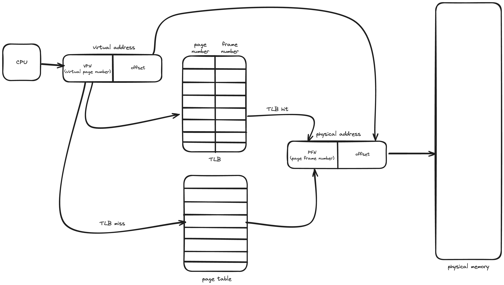  


### 4-4. Swapping  

**Memory Hierarchy**  
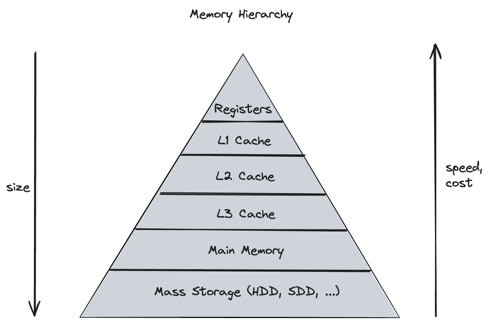  

Swap space
- 디스크의 공간 일부를 페이지 스왑 공간으로 사용  
- swap space의 크기가 실제 사용될 메모리 페이지의 최대 수를 결정  
- OS는 페이지 크기의 unit으로 이루어진 swap space가 어딘지 알고 있어야 함  
- Block size는 page size와 동일  

<br/>

Swap 대상  
- Kernel code, Kernel data
    - 절대 swap되지 않음(항상 메모리에 상주)
- Page tables for user processes
    - Not swapped
- Kernel stack for user processes
    - Not swapped
- User code pages
    - Dropped
    - disk에 원본이 있기 때문에 버려도 무방  
- User data pages
    - Dropped or swapped
- User heap / stack pages
    - Swapped
- Files mapped to user processes
    - Dropped or go to file system
- Page cache pages
    - Dropped or go to file system  

페이지 교체 정책(알고리즘)이 swap out할 페이지를 선택  

**페이지 교체 알고리즘**  
- FIFO
    - 페이지 교체 발생 시, 가장 먼저 들어온 페이지가 교체됨  
    - Belady's Anomaly(모순)
        - 캐시가 커지면 cache hit rate이 증가할 것 같지만, FIFO에서는 오히려 감소함  
        - 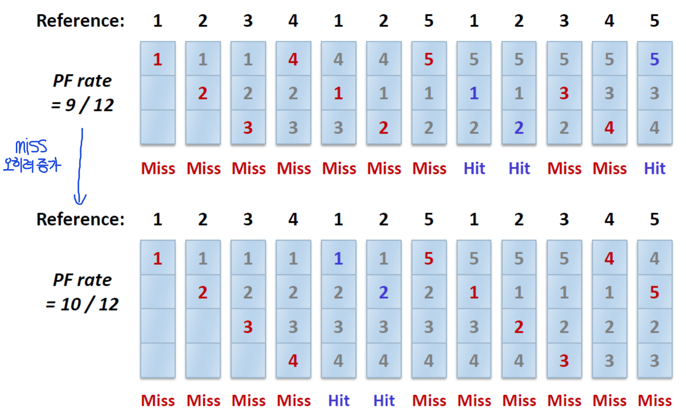
- LRU
    - Least Recently Used
    - 오래동안 사용되지 않은 페이지를 교체  
- LFU
    - Least Frequently Used
    - 참조 횟수가 가장 적은 페이지를 교체  
- Clock Algorithm
    - 시스템의 모든 페이지가 circular list 형태로 관리  
    - 시침이 돌듯이 돌면서 use bit(reference bit)이 0인 페이지를 찾아 교체(reference bit이 1인 페이지는 bit를 0으로 변경)  

<br/>

## 5.Threads  

한 프로세스 내의 실행(혹은 작업) 단위이자 CPU 이용의 기본 단위  

[Scheduling](#3-scheduling) 항목에서 프로세스가 스케줄링 단위인 것처럼 설명했지만, 최근에는 대부분 쓰레드가 CPU scheduling의 최소 단위이다.  

쓰레드는 고유한 Thread ID, PC(Program Counter)와 SP(Stack Pointer)를 포함하는 레지스터들, Stack을 가진다.  

<br/>

**Context switch between Threads**  

각 쓰레드는 고유의 PC와 레지스터들을 갖기 때문에 이들의 상태를 저장하고 복구하기 위해서는 쓰레드 별로 TCB(Thread Control Block)이 필요  

실행중인 쓰레드(T1)에서 다른 쓰레드(T2)로 swtich 한다면,
- T1의 레지스터 상태를 저장
- T2의 레지스터 상태 복구
- address space는 동일하게 남아있는다.  

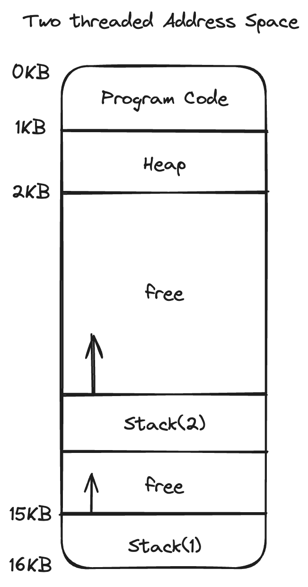  


### 5-1. Process vs Threads  

- 쓰레드는 한 개의 프로세스에 귀속된다.  
- 프로세스는 여러개의 쓰레드를 가질 수 있다.  
- 모두 같은 address space를 바라보기 때문에 쓰레드 간 데이터 공유는 비용이 싸다.  
- 쓰레드는 scheduling의 단위이다.  
- 프로세스는 쓰레드가 실행되는 컨테이너다.  
    - PID, address space, user and group ID, open file descriptors, current working directory 등을 모든 쓰레드가 공유한다.  


### 5-2. Multi-threading의 이점  
- Responsiveness(응답성)
    - 동시 이벤트를 처리할 수 있음(e.g. web servers)  
    - 하나의 웹 서버는 여러 클라이언트들이 접근할 수 있음
    - 단일 쓰레드로 이루어진 프로세스로 웹 서버가 작동한다면, 한 번에 하나의 클라이언트만 서비스할 수 있음  
    - 하지만 multi threaded process라면 클라이언트의 요청을 listen하는 쓰레드를 생성하고, 클라이언트의 요청이 들어오면 요청을 처리할 새로운 쓰레드를 생성하고 계속해서 클라이언트의 요청을 listen할 수 있음  
- Resource sharing(자원 공유)
    - 쓰레드는 자신이 속한 프로세스의 자원들과 메모리를 공유  
- 경제성
    - 프로세스 생성을 위한 메모리, 자원 할당은 비용이 많이 든다.
    - 쓰레드는 자신이 속한 프로세스의 자원들을 공유하기 때문에 쓰레드를 생성하고, context switch 하는 비용이 더 적다.  

### 5-3. Kernel-level Threads  

OS에 의해 관리되는 쓰레드들  
- OS가 쓰레드와 프로세스들을 관리
- 모든 쓰레드의 작업이 커널에 구현되어 있음  
- 쓰레드 생성과 관리는 시스템 콜을 필요로 함  
- OS가 모든 쓰레드들을 스케줄링함  
- 동일한 프로세스에서 할당된 여러 개의 쓰레드 중 한 쓰레드가 Block되더라도 다른 쓰레드들은 실행 가능

<br/>

**한계점**  
- 쓰레드의 작업이 모두 시스템 콜임(user mode와 kernel mode를 오가는 비용 발생)  
- 늘어나는 쓰레드에 대해 OS가 잘 대처해야 함  
- 커널 레벨 쓰레드는 모든 프로그래머, 언어, 런타임 시스템를 지원하기 위해 general해야 함  


### 5-4. User-level Threads  
- User level에서 구현된 쓰레드들
- 프로그램에 링크된 라이브러리가 쓰레드들을 관리  
- OS에게 보이지 않음  
- 커널 쓰레드에 비해 가볍고 빠름  
- Portable
- 애플리케이션의 니즈를 충족시키기 위해 튜닝이 가능함  

<br/>

**한계점**  
- OS가 사용자 레벨의 쓰레드를 인식하지 못하기 때문에, 잘못된 결정을 내릴 수 있음
- user-level 쓰레드 중 한 쓰레드가 Block 당하면 모든 user-level 쓰레드가 Block됨  

<br/>

### 5-5. Race condition  

공유 자원에 여러 쓰레드가 접근할 때, 접근 순서에 따라 결과가 달라지는 현상  

<br/>

**Critical section**  

공유 자원(변수, ...)에 접근하기 때문에 둘 이상의 쓰레드가 동시에 실행하면 안되는 코드 부분  
- 여러 개의 쓰레드가 critical section을 수행하면 race condition(경쟁 상태)에 빠질 수 있음  
- critical section에 대한 mutual exclusion(상호 배제) 필요  
    - atomic(전부 수행되거나 하나도 수행되지 않거나)하게 수행되어야 함  
    - 한 개 쓰레드만 한번에 수행해야 함  
    - 쓰레드가 critical section을 뻐나면 다른 쓰레드가 진입 가능  

<br/>

**Mutual exclusion**  

한 쓰레드가 critical section을 실행중이라면, 다른 쓰레드가 critical section에 진입하지 못함을 보장하는 것  

<br/>

**Sharing Resources(공유 자원)**  
- local variable은 쓰레드 간 공유되지 않음(stack 영역에 있지만 쓰레드들은 각자의 stack 영역을 가짐)  
- global variable, dynamic object는 쓰레드 간 공유됨  


공유 자원에 대한 접근을 컨트롤하는 동기화 메커니즘이 필요  

<br/>

### 5-6. Locks  

어떤 critical section이든 하나의 atomic instruction처럼 동작하도록 보장하자  

Lock variable
- Lock의 상태를 담는 변수  
- available(or unlocked, free)
    - 어떤 쓰레드도 락을 갖고 있지 않음  
- acquired(or locked, held)
    - 정확히 한개의 쓰레드가 lock을 갖고 critical section에 있을 것  

<br/>

**Requirements for Locks**  
- Correctness(정확성)
    - Mutual exclusion
        - 반드시 한개의 쓰레드만 critical section에 있어야 함  
    - Progress(deadlock-free)
        - 만약 여러 쓰레드가 critical section에 진입하고 싶어 한다면, 반드시 하나는 진입하도록 해야 한다  
    - Bounded waiting(starvation-free)
        - 결국엔 반드시 대기중인 쓰레드들이 critical section에 진입할 수 있도록 해야함  
- Fairness(공정성)
    - 각 쓰레드는 lock을 획득하는 데 있어 공정한 기회를 가짐  
- Performance(성능)  

<br/>

**Spin lock**  
다른 쓰레드가 Lock을 소유하고 있다면, 해당 Lock이 반환될 때까지 계속 확인하면 기다리는 것  

<br/>

**Lock의 구현**
- interrupts 컨트롤(매우 초창기) 
    - critical section에 대한 interrupt가 불가능하도록  
    - lock과 관련된 상태가 없음  
    - interrupt가 불가능하도록 했기 때문에 application이 자발적으로 CPU를 양보할 것이라는 믿음을 바탕에 깔아야 함  
    - 멀티프로세서 시스템에서는 동작하지 않음  
- 소프트웨어, 알고리즘을 통한 구현
- atomic instruction 하드웨어
    - Test-And-Set(Atomic Exchange)
    - Compare-And-Swap
    - Load-Linked(LL) and Store-Conditional(SC)
    - Fetch-And-Add
    - Ticket Lock

<br/>

### 5-7. Semaphore  

정수 값 하나를 갖는 객체  
- wait(), post() 두 함수를 호출해 조작할 수 있음  

```C
#include <semaphore.h>
sem_t s;
sem_init(&s, 0, 1);
```

초기화(sem_init)의 두 번째 인자는 같은 프로세스 내에서 쓰레드 간 공유 여부를 나타낸다.
- 0일 경우 프로세스 내에서 쓰레드들끼리 공유
- 1일 경우 프로세스 간 공유  

세 번째 인자는 세마포어가 가지는 초기 값  

***sem_wait()***
```C
int sem_wait(sem_t *s) {
    // decrement the value of semaphore s by one
    // wait if value of semaphore s is negative
}
```

세마포어 값을 1 감소시킨 후, 세마포어 값이 음수라면 대기하고 그렇지 않다면 return.   
세마포어 값이 음수라면, 이는 wait 중인 쓰레드의 수를 나타내는 것이다.  

<br/>

***sem_post()***
```C
int sem_post(sem_t *s) {
    // increment the value of semaphore s by one
    // if there are one or more thraeds waiting, wake one
}
```

세마포어 값을 1 증가시킨다.  
wait 중인 쓰레드가 있다면, 그 중 하나를 깨운다.   

<br/>

Binary Semaphore(세마포어 값이 1)의 동작  
Lock 처럼 사용

```C
sem_t s;
set_init(&s, 0, 1);

sem_wait(&s);
// critical section
sem_post(&s);
```  

<br/>

두 개 쓰레드(T1, T2)가 Binary Semaphore를 사용한다면  

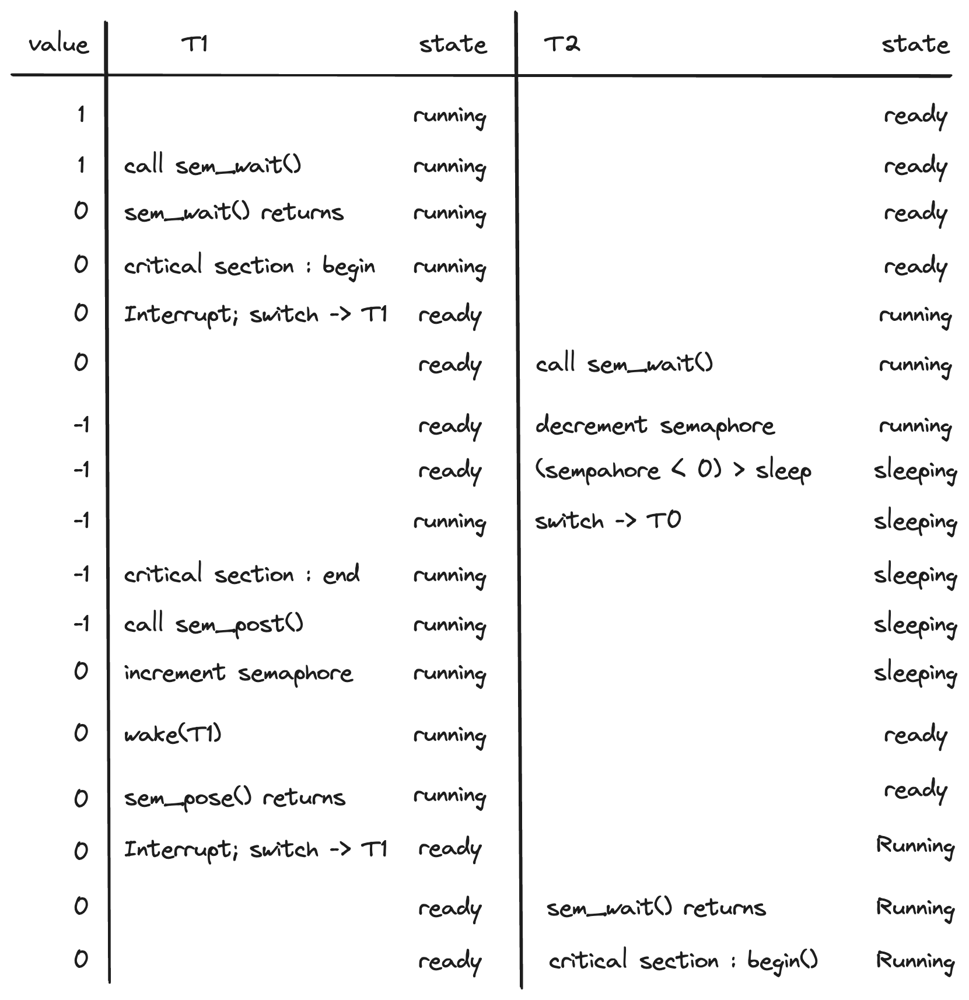  


<br/>

***Dining Philoshpers***  

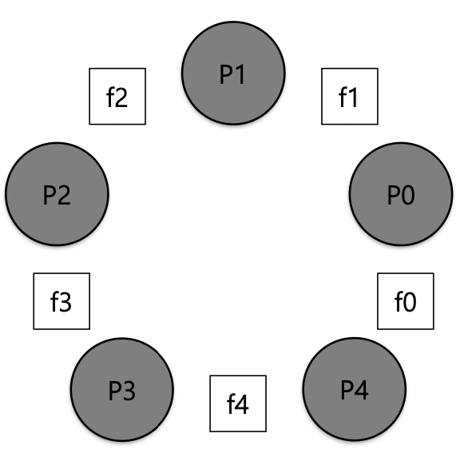  
- Pn : 철학자
- fn : 포크  


철학자들이 원형 식탁에 앉아 식사를 한다.  
각 철학자 양 쪽에는 포크가 하나씩 놓여져 있으며, 음식을 먹기 위해선 양쪽의 포크 2개를 모두 들어야 한다.  

두 개 포크를 집는 행위를 Lock, 음식을 먹는 행위를 Critical section으로 생각할 수 있는 유명한 문제  

Deadlock 없이, 누구도 굶지 않고 음식을 먹을 수 있을까?  

모두가 같은 순서(왼쪽 포크부터 잡고, 오른쪽 포크를 잡는)로 포크를 잡는다면  
- 모두가 동시에 왼쪽 포크를 잡으면 그 누구도 오른손에는 포크를 잡을 수 없다.
- Deadlock 발생  

<br/>

이를 해결하기 위한 가장 간단한 방법은 철학자들 중 한명은 오른쪽 포크부터 잡도록 순서를 바꾸는 것이다.  

<br/>

## 6. File system  

**File System Layers**  
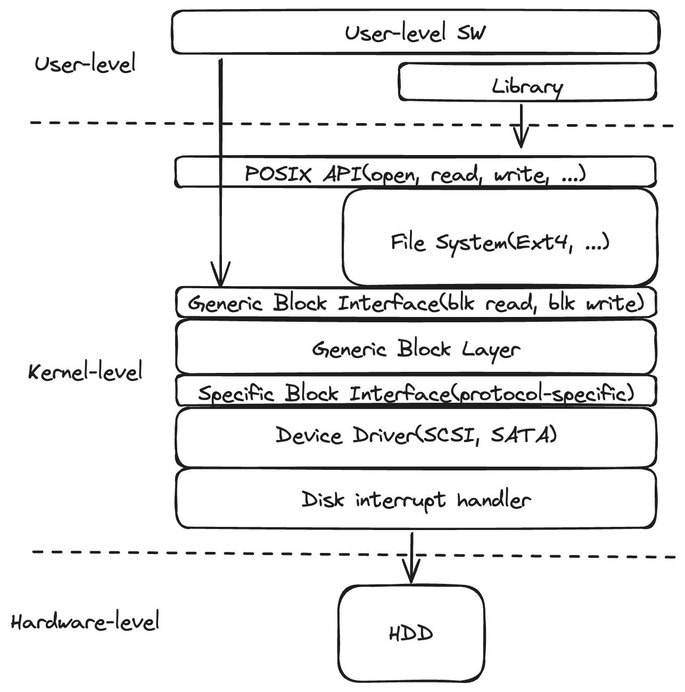  

<br/>

Abstractions for Storage
- File
    - 영구 스토리지에 기록된 이름이 있는 서로 연관된 정보들의 집합
    - 각 파일은 inode number(internal file ID)를 가짐
    - 부여되는 inode number들은 파일 시스템 내에서 유니크함
- Directory
    - 파일들을 조직화할 수 있는 구조 제공
    - 사용자가 읽을 수 있는 파일 이름을 해당 inode number에 매핑하는 데 사용되는 특수한 파일
        - list of <file name, inode number>
    - 계층적인 디렉토리 트리
        - 디렉토리는 다른 디렉토리 내에 위치할 수 있음  

<br/>

**File System Basic**  

File
- File contents (data)
    - byte 배열
    - 파일 시스템은 일반적으로 file contents가 무엇이든 신경쓰지 않음  
- File attributes (metadata or inode)
    - File type
        - regular, directory, symlink, ...
    - 파일이 들어있는 Device의 ID
    - Inode number
    - 접근 허가
        - rwx(read, write, execute) for owner(u), group(g), and others(o)
    - 하드 링크의 수
    - 소유자의 User ID와 group ID
    - byte 단위의 파일 크기
    - 할당된 512B 블록 수
    - 마지막 접근 시간(atime), 마지막 수정 시간(mtime), 마지막 상태 변경 시간(ctime)  

<br/>

**Hard link vs. Symbolic link**  

- Hard link
    ```bash
    ln old.txt new.txt
    ```
    - 두 pathname은 같은 inode number 사용
    - 어떤 것이 원본인지 알 수 없음
    - Inode는 하드 링크의 수를 유지
    - 파일 삭제(Deleting, unlinking) 시 링크 수가 감소
    - 링크 수가 0이 되면 inode가 제거됨
    - 디렉토리에는 하드 링크 생성 불가
- Symbolic link
    ```bash
    ln -s old.txt new.txt
    ```
    - 새 파일(new.txt)에는 source 파일 혹은 디렉토리에 대한 상대/절대 경로에 대한 참조(reference)가 포함되어 있음  

<br/>


**VSFS(Very Simple File System)**  
수업 자료에서 파일 시스템 설명을 위해 채택한 간단한 파일 시스템 예시  


Data Blocks
- 디스크를 일정 크기의 블록으로 나누었을 때 해당 블록 중 대부분을 차지하는 요소 
- user의 데이터를 저장하는데 사용  

<br/>

Inodes
- inode는 메타데이터를 갖고 있음  
- inode의 크기는 고정(보통, 128B ~ 256B)  
- inode 당 256B일 때, 4KB 블록은 16개의 inode를 가짐  
- inode 블록의 수와 inode의 크기를 바탕으로 다룰 수 있는 최대 파일 수를 계산 가능  

<br/>

Bitmaps
- Data bitmap & Inode bitmap  
- 각 비트(bit)는 해당 block/inode가 사용중(1)인지 비어있는지(0)를 나타냄  
- 하나의 data bitmap(또는 inode bitmap) 블록은 최대 32K data blocks(또는 inodes)를 지원할 수 있음  

<br/>

Superblock  
- Superblock은 파일시스템의 메타데이터를 갖고 있음  
    - File system type
    - Block size
    - Total number of blocks
    - Number of inodes
    - Number of data / inode bitmap blocks, ...  

<br/>

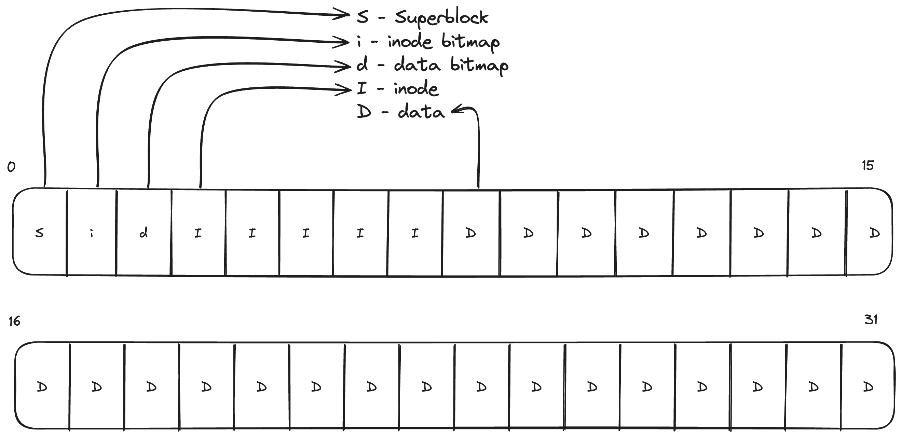

파일 시스템을 마운트하게 되면, OS는 가장 먼저 superblock을 읽고 다양한 정보를 초기화함  


<br/>

**disk block들과 file 간 매핑**

1.File Allocation Table(FAT)  

linked allocation의 변형
- 모든 파일의 linked list 정보를 FAT에 유지  
- FAT는 메인 메모리에 캐시됨  
- Metadata : <starting block #> + FAT
- random access 성능 개선(단순 linked list 방식은 data block에 포인터 공간을 따로 둬야했음)  

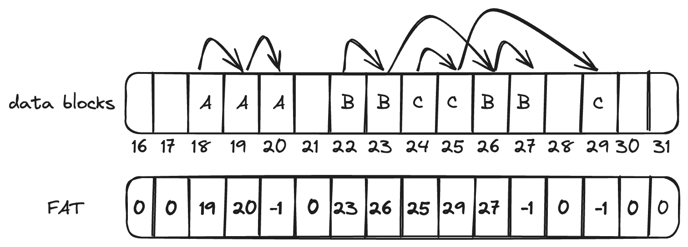  

<br/>

2.Indexed Allocation  

각 파일에 고정된 크기의 블록을 할당
- Metadata : 블록 포인터를 담은 배열  
- 각 블록 포인터는 데이터가 저장된 블록을 가리킴  
- 메타데이터로 인해 오버헤드 발생
    - 사용되지 않는 포인터들을 위해 공간을 낭비함  

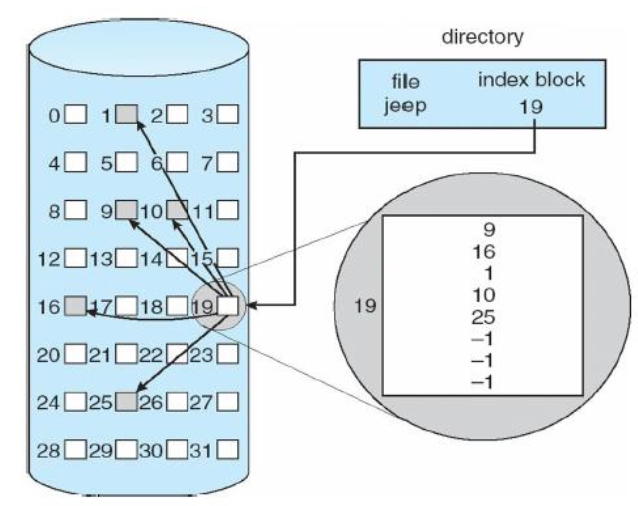  

<br/>

3.Multi-level Indexing  

indexed allocation의 변형
- 포인터 계층을 데이터 블록에 동적으로 할당  
- Metadata : direct pointers + indirect pointers  
- Example : Unix FFS, Linux Ext2/3  
- 동적으로 포인터를 할당하기 때문에 indexed allocation에서 있었던 포인터로 인한 공간 낭비를 해결  
- 주소 계산을 위해 포인터의 indirect block을 read해야 함(추가적인 disk read)  

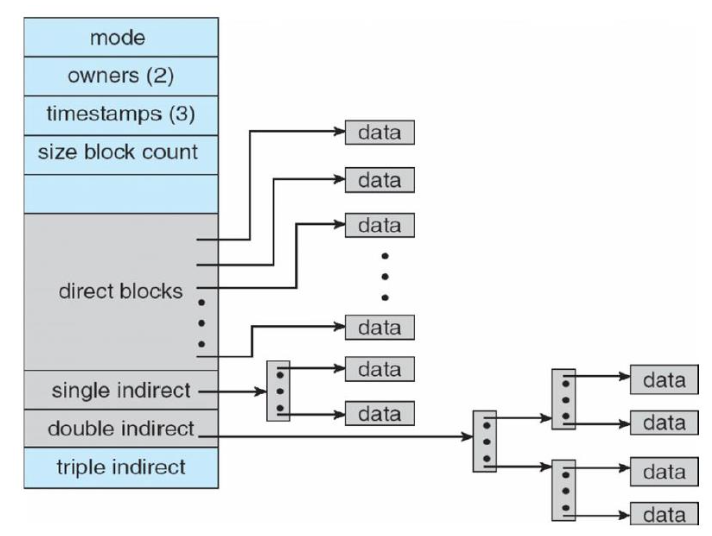  

4.Extent-based Allocation  

파일당 여러 개의 연속된 영역(블록) 할당
- extent(연속된 블록)를 multi level tree처럼 구성
    - e.g. B+ tree
- Each leaf node : <starting block #, extent size>
- Example : Linux Ext4  

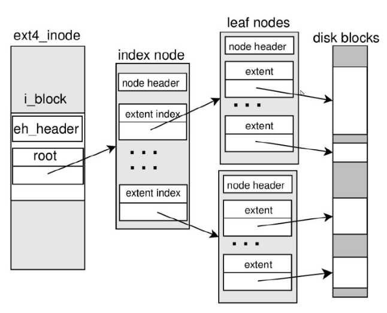  

